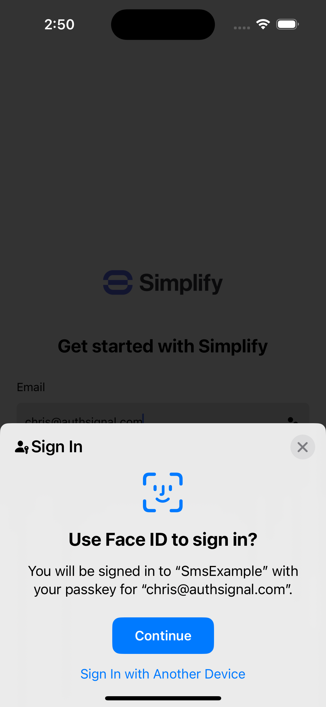

## Example app

<p float="left">


</p>

## Getting started

Copy `.env.example` and rename to `.env` then fill in the values for your AWS and Authsignal configuration.

```
API_GATEWAY_ID=
AWS_REGION=
AUTHSIGNAL_TENANT=
AUTHSIGNAL_CLIENT=
AUTHSIGNAL_URL=
```

Then install dependencies and run the app.
