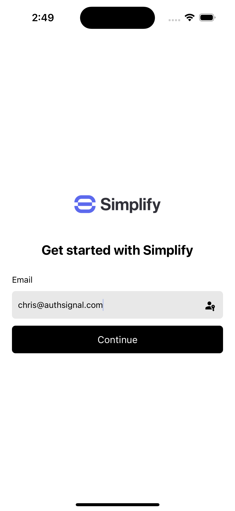

# Mobile SDK example app

This repository contains an example app implemented in React Native which showcases the [Authsignal Mobile SDK](https://docs.authsignal.com/sdks/client/mobile).

## Example app

<p float="left">


</p>

## Example backend

This example app depends on backend APIs included in [this Github repository](https://github.com/authsignal/api-example-lambdas).

## Getting started

Copy `.env.example` and rename to `.env` then fill in the values for your AWS and Authsignal configuration.

```
API_GATEWAY_ID=
AWS_REGION=
AUTHSIGNAL_TENANT=
AUTHSIGNAL_CLIENT=
AUTHSIGNAL_URL=
```

Then install dependencies and run the app.
